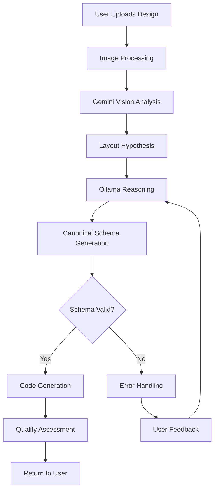

# 🏗️ Structra — System Architecture

This document explains Structra's system architecture, its components, and how they interact.

---

## 🎯 Overview

Structra is an AI system designed to analyze visual designs and generate maintainable frontend structures. The system uses a **role-based reasoning** approach with **canonical schema** as the single source of truth.

---

## 🧩 System Components

### Frontend Layer (Next.js)

```
┌─────────────────────────────────────┐
│   Next.js App (SaaS Dashboard)      │
├─────────────────────────────────────┤
│  - User Interface                   │
│  - Image Upload                     │
│  - Code Preview (Monaco Editor)     │
│  - Schema Editor                    │
│  - Project Management               │
└─────────────────────────────────────┘
```

**Responsibilities:**
- User interface for uploading designs
- Preview and edit canonical schema
- Code output visualization
- Project management

---

### Backend API Layer (Elysia.js + Bun)

```
┌─────────────────────────────────────┐
│   Elysia.js API Server              │
├─────────────────────────────────────┤
│  - Request Handling                 │
│  - Authentication                  │
│  - Rate Limiting                    │
│  - Image Processing                │
│  - AI Orchestration                │
└─────────────────────────────────────┘
```

**Responsibilities:**
- Handle API requests
- Orchestrate AI pipeline
- Manage authentication & authorization
- Process and validate inputs

---

### AI Orchestration Layer

```
┌─────────────────────────────────────┐
│   AI Orchestration Engine           │
├─────────────────────────────────────┤
│  ┌──────────────────────────────┐  │
│  │  Gemini Vision (Analysis)     │  │
│  └──────────────────────────────┘  │
│           ↓                         │
│  ┌──────────────────────────────┐  │
│  │  Ollama (Reasoning)           │  │
│  └──────────────────────────────┘  │
│           ↓                         │
│  ┌──────────────────────────────┐  │
│  │  Code Generator               │  │
│  └──────────────────────────────┘  │
└─────────────────────────────────────┘
```

**Responsibilities:**
- Coordinate AI model interactions
- Manage role-based reasoning flow
- Generate canonical schema
- Produce code output

---

### Knowledge Base Layer

```
┌─────────────────────────────────────┐
│   Knowledge Base                    │
├─────────────────────────────────────┤
│  ┌──────────────────────────────┐  │
│  │  PostgreSQL                  │  │
│  │  - UI Patterns               │  │
│  │  - Tailwind Recipes          │  │
│  │  - SVG Strategies            │  │
│  │  - Past Solutions            │  │
│  └──────────────────────────────┘  │
│  ┌──────────────────────────────┐  │
│  │  Qdrant (Vector DB)           │  │
│  │  - Similar Layout Matching    │  │
│  │  - RAG Prompting             │  │
│  └──────────────────────────────┘  │
└─────────────────────────────────────┘
```

**Responsibilities:**
- Store UI patterns and recipes
- Enable similar layout matching
- Support retrieval-augmented generation
- Learn from user revisions

---

## 🔄 Data Flow



### Detailed Flow

1. **Input Processing**
   - User uploads design image (PNG/JPG)
   - Optional textual description
   - Image preprocessing (Sharp)
   - Validation and sanitization

2. **Visual Analysis (Gemini Vision)**
   - Image understanding
   - Layout detection
   - Component identification
   - Visual hierarchy mapping

3. **Reasoning (Ollama)**
   - Role: Analyzer — Initial observations
   - Role: Layout Engineer — Structural decisions
   - Schema generation
   - Strategy selection

4. **Schema Validation**
   - Check completeness
   - Validate structure
   - Verify assumptions documented
   - Handle ambiguities

5. **Code Generation**
   - Role: Code Generator
   - Transform schema to code
   - Apply engineering constraints
   - Generate HTML + Tailwind/React

6. **Quality Assessment**
   - Evaluate confidence levels
   - Assess risks
   - Document manual adjustments needed

7. **Output Delivery**
   - Return schema + code
   - Provide quality metrics
   - Enable user editing

---

## 🏛️ Architecture Patterns

### Role-Based Reasoning

The system uses three internal roles that work sequentially:

```
Analyzer → Layout Engineer → Code Generator
```

Each role has clear responsibilities and no overlap. See [04 AI Roles](04%20AI%20Roles.md) for details.

### Canonical Schema Pattern

All AI decisions are represented in canonical schema before code generation. This enables:
- Users can edit schema before generating code
- Schema can be versioned and audited
- Deterministic code generation

See [03 Canonical Schema](03%20Canonical%20Schema.md) for details.

### Knowledge Base Integration

The system uses RAG (Retrieval-Augmented Generation) to:
- Search for similar solutions from knowledge base
- Use proven patterns
- Continuously learn from user feedback

---

## 🔌 Integration Points

### External Services

```
┌─────────────┐
│  Gemini API │ ← Cloud LLM for vision
└─────────────┘

┌─────────────┐
│   Ollama    │ ← Local LLM for reasoning
└─────────────┘

┌─────────────┐
│  S3 Storage │ ← Design image storage
└─────────────┘

┌─────────────┐
│ PostgreSQL  │ ← Structured data
└─────────────┘

┌─────────────┐
│   Qdrant    │ ← Vector similarity search
└─────────────┘
```

### Internal Services

- **Redis** — Caching and rate limiting
- **Prisma ORM** — Database abstraction
- **Sharp** — Image processing

---

## 🔒 Security Architecture

### Request Isolation
- Each request processed in isolated context
- No data leakage between requests

### Input Validation
- Image validation (format, size, content)
- Text sanitization
- Prompt injection prevention

### Authentication & Authorization
- API key or OAuth-based auth
- Role-based access control
- Rate limiting per user/team

---

## 📈 Scalability Considerations

### Horizontal Scaling
- Stateless API servers
- Load balancing
- Database connection pooling

### Caching Strategy
- Redis for AI response caching
- CDN for static assets
- Database query caching

### Performance Optimization
- Async processing for heavy tasks
- Batch processing for multiple requests
- Efficient image processing pipeline

---

## 🧪 Testing Architecture

### Unit Tests
- Individual component testing
- Schema validation testing
- Code generation testing

### Integration Tests
- API endpoint testing
- AI pipeline testing
- Database integration testing

### E2E Tests
- Full user flow testing
- Quality assessment validation
- Error handling verification

---

## 📊 Monitoring & Observability

### Metrics
- Request latency
- AI model response times
- Error rates
- Schema generation success rate

### Logging
- Structured logging for all operations
- AI reasoning traces (optional, for debugging)
- User action tracking

### Alerting
- Error rate thresholds
- Performance degradation
- Service availability

---

## 🔄 Deployment Architecture

### Development
- Local Docker Compose setup
- Local Ollama instance
- Development database

### Staging
- Cloud deployment (Fly.io/Railway)
- Staging database
- Test API keys

### Production
- Multi-region deployment
- Production database with replication
- Monitoring and alerting
- Backup and disaster recovery

---

<div align="center">

## 📖 Navigation

<table>
<tr>
<td align="left">

**[← Previous: Tech Stack](08%20Tech%20Stack.md)**  
*Tech Stack Documentation*

</td>
<td align="center">

**[↑ Index](README.md)**  
*Documentation Overview*

</td>
<td align="right">

**[Next: API Documentation →](10%20API%20Documentation.md)**  
*API Documentation*

</td>
</tr>
</table>

---

<details>
<summary><b>📚 Quick Navigation</b></summary>

<table>
<tr>
<td>

**Previous:** [Tech Stack](08%20Tech%20Stack.md)  
Technologies used to build Structra

</td>
<td>

**Next:** [API Documentation](10%20API%20Documentation.md)  
API endpoints, request/response formats, examples

</td>
</tr>
</table>

</details>

</div>

